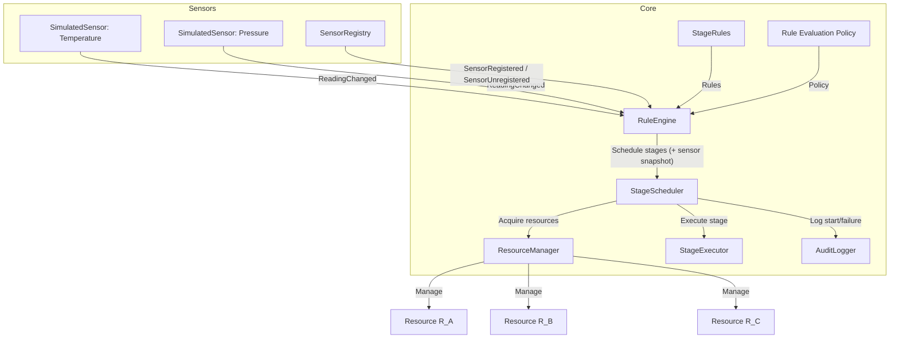

# Architecture

## Overview

The system simulates a manufacturing controller that:

- Reads sensor values (Temperature, Pressure) at 100 ms intervals.
- Evaluates rules to decide which production stages should run.
- Acquires shared resources (R_A, R_B, R_C) safely.
- Executes stages concurrently where possible.

## Main Components

### Sensors

- `ISensor`: Represents a sensor with a type, current reading, and `ReadingChanged` event.
- `SimulatedSensor`: Generates periodic readings every 100 ms. Each tick is
  individually fault-isolated: a throwing value-generator or a throwing
  `ReadingChanged` subscriber is caught, logged via
  `IAuditLogger.LogSensorReadingFailed`, and the loop continues to the next
  tick rather than dying silently and permanently.
- `ISensorRegistry`: Manages registration/unregistration of sensors, and raises
  `SensorRegistered` / `SensorUnregistered` when the set changes.
- `SensorRegistry`: In‑memory implementation of `ISensorRegistry`.

Responsibilities:

- Provide current and streaming sensor data.
- Allow dynamic addition, removal, and replacement of sensors — including
  while a `RuleEngine` is already running, not just at startup (see
  "Rules & Engine" below and [Design Rationale](design-rationale.md)).

### Resources

- `Resource`: Represents a physical resource with states Idle, Busy, Error.
- `IResourceManager` / `ResourceManager`: Manages acquisition and release of resources.
- `ResourceManagerNaive`: A deadlock‑prone implementation used for demonstration.

Responsibilities:

- Track resource state.
- Provide safe, atomic acquisition of multiple resources.
- Prevent deadlocks by never holding one resource while waiting on another
  (see [concurrency.md](concurrency.md) for why this — not lock ordering —
  is what actually makes `ResourceManager` deadlock-free).

### Stages

- `StageDefinition`: Defines a stage (Stage1, Stage2, Stage3) and its required resources.
- `IStageExecutor` / `SimulatedStageExecutor`: Executes a stage (simulated work).
- `IStageScheduler` / `StageScheduler`: Schedules stages, ensuring at most one instance per stage runs at a time (via an atomic `ConcurrentDictionary.TryAdd` reservation), and is the single place that logs a stage as scheduled (on actual start) or failed.
- `NaiveStageTracker`: A check‑then‑act‑prone tracker used for demonstration — reproduces the atomicity violation `StageScheduler` once had (see [Concurrency Design](concurrency.md)).

Responsibilities:

- Map stage IDs to resource requirements.
- Guarantee at most one concurrent execution per stage id.
- Execute stage logic concurrently.
- Coordinate with `IResourceManager` for resource acquisition.
- Log stage start/failure via `IAuditLogger`.

### Rules & Engine

- `StageRule`: Condition (predicate over sensor values) → set of stages.
- `DefaultRules`: Defines the three business rules from the exercise.
- `IRuleEvaluationPolicy` / `UnionRuleEvaluationPolicy`: Strategy for evaluating multiple matching rules.
- `IRuleEngine` / `RuleEngine`: Subscribes to sensor events, evaluates rules, and requests stage execution.

Responsibilities:

- Maintain current sensor values.
- Evaluate rules on each sensor update.
- Request stage execution via `IStageScheduler`, passing the sensor snapshot
  that led to the request (`StageScheduler` decides whether that request
  turns into an actual start, and logs accordingly — `RuleEngine` itself has
  no audit-logging or resource/stage-definition knowledge).
- React to the sensor set changing at runtime: subscribe to a newly
  registered sensor, unsubscribe from a removed one, and move the
  subscription across when one is replaced — not just read the registry once
  at construction.

## Communication Patterns

- **Event‑driven**: Sensors raise `ReadingChanged`; `RuleEngine` subscribes and
  reacts. `ISensorRegistry` itself raises `SensorRegistered` /
  `SensorUnregistered` so `RuleEngine` can keep its own subscriptions in sync
  with the registry for as long as it runs.
- **Dependency injection**: Components depend on interfaces (`ISensorRegistry`, `IResourceManager`, etc.), enabling testability and substitution.
- **Asynchronous throughout**:
  - Resource acquisition is asynchronous (`IResourceManager.AcquireAsync`) — a
    caller waiting on a busy resource polls via `await Task.Delay(...)`
    rather than blocking a thread-pool thread for the wait.
  - Stage execution is asynchronous (`Task.Run` in `StageScheduler`).

## Audit Logging

- Audit logging is implemented via `IAuditLogger` / `AuditLogger` in the `NovaExercise.Core.Logging` namespace.
- `StageScheduler` logs a stage as scheduled at the moment it actually
  transitions from not-running to running (guarded by the same `TryAdd` that
  prevents duplicate execution) — not every time a rule evaluation matches
  it. Without this, a stage that matches on two sensors ticking close
  together would be logged as "scheduled" twice even though only one
  execution ever runs. Each entry includes:
  - Stage ID (Stage1, Stage2, Stage3)
  - Sensor values at the moment the request was made (Temperature, Pressure)
  - Required resources for that stage (R_A, R_B, R_C)
  - Timestamp
- If a stage's execution throws, `StageScheduler` logs it via
  `LogStageFailed` (`OperationCanceledException` from normal shutdown is not
  treated as a failure). If rule evaluation or scheduling itself throws,
  `RuleEngine` logs it via `LogRuleEvaluationFailed`. If a sensor's own
  value-generator or a `ReadingChanged` subscriber throws, `SimulatedSensor`
  logs it via `LogSensorReadingFailed`.
- Example log lines:

  ```text
  [AUDIT] 2026-09-16 13:25:10.123 | Stage=Stage1 | Sensors=Temperature:15.23, Pressure:78.90 | Resources=R_A, R_B
  [AUDIT] 2026-09-16 13:25:15.456 | Stage=Stage2 | FAILED | TimeoutException: Timed out waiting for resource R_C to become available (requested: R_B, R_C, timeout: 00:00:05)
  [AUDIT] 2026-09-16 13:25:20.789 | Sensor=Temperature | FAILED | InvalidOperationException: Simulated sensor fault
  ```

- The logging abstraction allows swapping `AuditLogger` for other implementations (e.g., file-based or structured logging) without modifying core components.

## Extensibility Points

- **New sensors**: Implement `ISensor` and register via `ISensorRegistry` —
  a running `RuleEngine` picks it up immediately, no restart needed.
- **New rules**: Add `StageRule` instances in `DefaultRules.Create()`.
- **Alternative policies**: Implement `IRuleEvaluationPolicy` (e.g., priority‑based).
- **Real hardware**: Replace `SimulatedSensor` and `SimulatedStageExecutor` with real implementations.
- **Cross-process consumers**: `ISensor.ReadingChanged` publication is the one seam that would change — see [Design Rationale](design-rationale.md) for why this is in-process today and how it would externalize behind a message broker.

# Architecture Diagram (mermaid)


