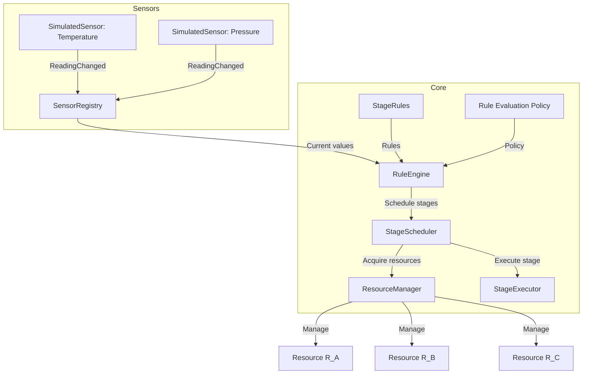

# Architecture

## Overview

The system simulates a manufacturing controller that:

- Reads sensor values (Temperature, Pressure) at 100 ms intervals.
- Evaluates rules to decide which production stages should run.
- Acquires shared resources (R_A, R_B, R_C) safely.
- Executes stages concurrently where possible.

## Main Components

### Sensors

- `ISensor`: Represents a sensor with a type, current reading, and `ReadingChanged` event.
- `SimulatedSensor`: Generates periodic readings every 100 ms.
- `ISensorRegistry`: Manages registration/unregistration of sensors.
- `SensorRegistry`: In‑memory implementation of `ISensorRegistry`.

Responsibilities:

- Provide current and streaming sensor data.
- Allow dynamic addition/removal of sensors.

### Resources

- `Resource`: Represents a physical resource with states Idle, Busy, Error.
- `IResourceManager` / `ResourceManager`: Manages acquisition and release of resources.
- `ResourceManagerNaive`: A deadlock‑prone implementation used for demonstration.

Responsibilities:

- Track resource state.
- Provide safe, atomic acquisition of multiple resources.
- Prevent deadlocks via global lock ordering.

### Stages

- `StageDefinition`: Defines a stage (Stage1, Stage2, Stage3) and its required resources.
- `IStageExecutor` / `SimulatedStageExecutor`: Executes a stage (simulated work).
- `IStageScheduler` / `StageScheduler`: Schedules stages, ensuring at most one instance per stage runs at a time.

Responsibilities:

- Map stage IDs to resource requirements.
- Execute stage logic concurrently.
- Coordinate with `IResourceManager` for resource acquisition.

### Rules & Engine

- `StageRule`: Condition (predicate over sensor values) → set of stages.
- `DefaultRules`: Defines the three business rules from the exercise.
- `IRuleEvaluationPolicy` / `UnionRuleEvaluationPolicy`: Strategy for evaluating multiple matching rules.
- `IRuleEngine` / `RuleEngine`: Subscribes to sensor events, evaluates rules, and schedules stages.

Responsibilities:

- Maintain current sensor values.
- Evaluate rules on each sensor update.
- Request stage execution via `IStageScheduler`.

## Communication Patterns

- **Event‑driven**: Sensors raise `ReadingChanged`; `RuleEngine` subscribes and reacts.
- **Dependency injection**: Components depend on interfaces (`ISensorRegistry`, `IResourceManager`, etc.), enabling testability and substitution.
- **Synchronous acquisition, asynchronous execution**:
  - Resource acquisition is synchronous (`IResourceManager.Acquire`).
  - Stage execution is asynchronous (`Task.Run` in `StageScheduler`).

## Audit Logging

- Audit logging is implemented via `IAuditLogger` / `ConsoleAuditLogger` in the `NovaExercise.Core.Logging` namespace.
- For each stage scheduled by the rule engine, the system logs:
  - Stage ID (Stage1, Stage2, Stage3)
  - Current sensor values (Temperature, Pressure)
  - Required resources for that stage (R_A, R_B, R_C)
  - Timestamp
- Example log line:

  ```text
  [AUDIT] 2026-09-16 13:25:10.123 | Stage=Stage1 | Sensors=Temperature:15.23, Pressure:78.90 | Resources=R_A, R_B
  ```

- The logging abstraction allows swapping `AuditLogger` for other implementations (e.g., file-based or structured logging) without modifying core components.

## Extensibility Points

- **New sensors**: Implement `ISensor` and register via `ISensorRegistry`.
- **New rules**: Add `StageRule` instances in `DefaultRules.Create()`.
- **Alternative policies**: Implement `IRuleEvaluationPolicy` (e.g., priority‑based).
- **Real hardware**: Replace `SimulatedSensor` and `SimulatedStageExecutor` with real implementations.

# Architecture Diagram (mermaid)

